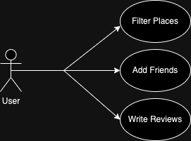

The content below is an example project proposal / requirements document. Replace the text below the lines marked "__TODO__" with details specific to your project. Remove the "TODO" lines.

# Places 

## Overview

When looking up things to do it’s hard to trust reviews. What if we could only see reviews from people we trust. This website will function as a more personalized method of verification of places you might like to try based upon people with whom you have added as a friend. Users can sign in or register. Then view a map. Users will be able to add other users as friends. On this map there will be features that allow users to filter the map based on the type of place you would like to go. Filters will be things like parks, bars, restaurants, movie theaters, etc. Additional filters will allow users to filter based on ratings that their friends have given. Users will be able to write reviews about places they have been. The reviews can either be private, friends only, or public. Businesses will also be able to sign in and verify their location on the map and decide which filtered category they belong in. 


## Data Model

The application will store Users, Reviews and Businesses

* users can have multiple reviews they will be stored by the review id
* businesses can have multiple reviews they will be stored by the review id
* reviews will store the user id of whoever wrote it
* reviews will store the business id of who it is about


An Example User:

```javascript
{
    userID: 123456, // unique identifier
    username: Squilliam,
    email: 'squill@hotmail.com',
    passwordHash: // a password hash,
    reviews: // array of reviewID's they've written 
    friends:  // array of other userID's
}
```

An Example Business:

```javascript
{
    businessID: 98765432, // unique business identifier
    name: "Big Paul's House of Munch",
    description: 'Enjoy burgers, milkshakes, and fries here!',
    email: 'bigPaul@bigPaul.com',
    passwordHash: // password hash,
    reviews:  // array of the reviews that have been written about them
    location:  // a saved location on the map
}
```
An Example Review:

```javascript
{
    reviewID: 71781843 // unique identifer of each review
    userID: 1223456, // to identify who wrote the review
    businessID: 98765432, // to identify the business being described
    rating: 5, // rating of 1-5
    text: "I loved big Paul's house of Munch! Go there!", // th actual review
    privacy: 'Friends Only' // to see who else can see this review
}
```

## [Link to Commented First Draft Schema](db.mjs) 

[db.mjs](db.mjs)

## Wireframes


/login - page for logging in or directing new users


/new-user - page for registering new user


/new-business - page for registering new business


/home - page where the main functionality of the website lies


## Site map


## User Stories or Use Cases

Use case for users



Use case for businesses


## Research Topics

* (6 points) React
    * Will be used a lot in the /home list and search feature 
    * also in the login/ registration pages
* (1 point) Google Maps API
    * interact with locations on the map
    * save and filter locations
* (3 points) Faker.js
    * use faker.js to create unit tests

## [Link to Initial Main Project File](app.mjs) 


## Annotations / References Used

nothing so far
(__TODO__: list any tutorials/references/etc. that you've based your code off of)

